# CAMS — Complaint State Machine

**Document:** `docs/architecture/COMPLAINT_STATE_MACHINE.md`
**Version:** 1.0 (**TEAM-APPROVED**)
**Date:** 2026-09-04 · **Approved:** 2026-09-04 (architecture sign-off)
**Status:** 🟢 **TEAM-APPROVED** as decision **AD-05** (ADR-0005). Implements
Requirements `REQUIREMENTS.md` v1.0 **D7** and **FR-COMP-006 / FR-MAINT-001..010**.
The **approach for rework** is approved: no `RETURNED` state; `RESOLVED →
IN_PROGRESS` + a `RETURN` history event + `returned_count`. **OQ-38 remains OPEN**
only for residual detail *beyond* this approach (a return-reason taxonomy; whether
the UI shows a distinct "returned, awaiting rework" indicator) — neither changes
the state set.

---

## 1. States (exactly D7 — no invented states)

| State | Meaning | Set by |
|-------|---------|--------|
| `PENDING` | Submitted by a citizen; awaiting Officer review. | system (on submit) |
| `ASSIGNED` | Officer accepted it, set priority, assigned one Worker. | Officer |
| `IN_PROGRESS` | Worker has started the repair. | Worker |
| `RESOLVED` | Worker recorded completion (mandatory completion photo + cost + remarks); awaiting Officer verification. | Worker |
| `VERIFIED` | Officer confirmed the completed work. | Officer |
| `CLOSED` | Complaint closed; maintenance-history entry created; asset status/condition may be updated. | Officer |
| `REJECTED` | Officer rejected during review (terminal). | Officer |

**OQ-38 decision:** there is **no `RETURNED` state**. When an Officer sends
`RESOLVED` work back for rework, the complaint returns to **`IN_PROGRESS`** and a
history event `RETURN` is recorded plus `complaint.returned_count += 1`. Rationale
in ADR-0005: keeps the state set identical to D7, avoids a near-duplicate of
`IN_PROGRESS`, and still yields the D32 "tasks returned" metric.

---

## 2. Transition diagram

```mermaid
stateDiagram-v2
  [*] --> PENDING: SUBMIT (Citizen)
  PENDING --> REJECTED: REJECT (Officer)
  PENDING --> ASSIGNED: ASSIGN (Officer, sets priority + worker)
  ASSIGNED --> ASSIGNED: REASSIGN (Officer)
  ASSIGNED --> ASSIGNED: PRIORITY_SET (Officer)
  ASSIGNED --> IN_PROGRESS: START (Worker)
  IN_PROGRESS --> IN_PROGRESS: PRIORITY_SET (Officer)
  IN_PROGRESS --> IN_PROGRESS: REASSIGN (Officer)
  IN_PROGRESS --> RESOLVED: RESOLVE (Worker, completion photo required)
  RESOLVED --> IN_PROGRESS: RETURN (Officer, reason; returned_count++)
  RESOLVED --> VERIFIED: VERIFY (Officer)
  VERIFIED --> CLOSED: CLOSE (Officer, optional asset status/condition update)
  REJECTED --> [*]
  CLOSED --> [*]
```

MVP has **no** transition out of `CLOSED` or `REJECTED` (reopen is Future/Secondary
— OQ-25; not implemented, not assumed).

---

## 3. Transition table

For every transition: who may do it, guard conditions, data written, notification,
audit event. All of it happens in **one DB transaction**.

| # | Event | From → To | Actor (role) | Guards | Data written | Notification (in-app) | Audit action |
|---|-------|-----------|--------------|--------|--------------|-----------------------|--------------|
| 1 | `SUBMIT` | — → `PENDING` | Citizen (own) | asset exists & in citizen's local body; description non-empty; 0..n CITIZEN_REPORT photos | `complaint` row; `status_history(SUBMIT, →PENDING)`; any citizen photos | all Officers of the local body: `COMPLAINT_SUBMITTED` | `COMPLAINT_CREATE` |
| 2 | `REJECT` | `PENDING` → `REJECTED` | Officer (same local body) | status = PENDING; reason non-empty | `complaint.status=REJECTED`, `rejected_reason`; `status_history(REJECT)` | Citizen: `COMPLAINT_REJECTED` (with reason) | `COMPLAINT_REJECT` |
| 3 | `ASSIGN` | `PENDING` → `ASSIGNED` | Officer | status = PENDING; workerId is an ACTIVE WORKER in the local body; priority ∈ enum | `worker_assignment(active)`; `complaint.status=ASSIGNED`, `priority`, `current_assignment_id`; `status_history(ASSIGN, note=priority)` | assigned Worker: `COMPLAINT_ASSIGNED` | `COMPLAINT_STATUS_CHANGE` + `ASSIGNMENT_CHANGE` + `PRIORITY_CHANGE` |
| 4 | `REASSIGN` | `ASSIGNED`\|`IN_PROGRESS` → same | Officer | new worker ≠ current; ACTIVE WORKER in local body; reason recommended | close old `worker_assignment` (`unassigned_at`, `active=false`); open new active one; update `current_assignment_id`; `status_history(REASSIGN, note=reason)` | new Worker: `COMPLAINT_ASSIGNED`; (optional) previous Worker: `COMPLAINT_ASSIGNED` (removed) | `ASSIGNMENT_CHANGE` |
| 5 | `PRIORITY_SET` | `PENDING`\|`ASSIGNED`\|`IN_PROGRESS` → same | Officer | priority ∈ enum | `complaint.priority`; `status_history(PRIORITY_SET, note=old→new)` | — (no citizen/worker notification for priority in MVP) | `PRIORITY_CHANGE` |
| 6 | `START` | `ASSIGNED` → `IN_PROGRESS` | Worker (the active assignee) | caller is the active assignee | `complaint.status=IN_PROGRESS`; `status_history(START)` | Citizen: `COMPLAINT_STARTED` | `COMPLAINT_STATUS_CHANGE` |
| 7 | `RESOLVE` | `IN_PROGRESS` → `RESOLVED` | Worker (active assignee) | **≥ 1 WORKER_COMPLETION photo present**; `repair_cost` ≥ 0 provided; remarks provided | completion photo(s); `complaint.status=RESOLVED`; store cost+remarks (held until close/history); `status_history(RESOLVE)` | assigning Officer: `COMPLAINT_RESOLVED`; Citizen: `COMPLAINT_RESOLVED` | `COMPLAINT_STATUS_CHANGE` |
| 8 | `RETURN` | `RESOLVED` → `IN_PROGRESS` | Officer | status = RESOLVED; reason non-empty | `complaint.status=IN_PROGRESS`; `returned_count += 1`; `status_history(RETURN, note=reason)` | active Worker: `COMPLAINT_RETURNED` (with reason) | `COMPLAINT_STATUS_CHANGE` |
| 9 | `VERIFY` | `RESOLVED` → `VERIFIED` | Officer | status = RESOLVED | `complaint.status=VERIFIED`; `status_history(VERIFY)` | — (Citizen notified at CLOSE) | `COMPLAINT_VERIFY` |
| 10 | `CLOSE` | `VERIFIED` → `CLOSED` | Officer | status = VERIFIED | `complaint.status=CLOSED`, `closed_at`; optional `asset.status` / `asset.condition` update; **create `maintenance_history`** (asset, complaint, summary, remarks, cost, worker, resulting status/condition, completion photo refs); `status_history(CLOSE)` | Citizen: `COMPLAINT_CLOSED` | `COMPLAINT_CLOSE` (+ `ASSET_UPDATE` if changed) |
| 11 | `FEEDBACK` (not a status change) | `CLOSED` → `CLOSED` | Citizen (reporter) | status = CLOSED; no existing feedback; rating in `1..feedback.rating.max` | `feedback` row | — | `COMPLAINT_UPDATE` (note = "feedback submitted") |

`VERIFY` + `CLOSE` **may be presented as one button** in the Officer UI; the server
still records both transitions (SYSTEM_ARCHITECTURE §6).

---

## 4. Guard details & invariants

- **Local-body scope:** every actor action is checked against the complaint's
  `local_body_id`. Officers: must match. Worker: must be the active assignee.
  Citizen: must be `reported_by`.
- **Completion photo (D11):** `RESOLVE` is rejected (`error = completion_photo_required`)
  unless at least one `COMPLAINT_PHOTO(kind = WORKER_COMPLETION)` exists (uploaded in
  the same request or earlier in this `IN_PROGRESS` cycle).
- **Priority (D9):** may be set/changed by an Officer at any pre-`RESOLVED` state; a
  first priority is mandatory as part of `ASSIGN`.
- **One active assignment:** enforced — a new `ASSIGN`/`REASSIGN` deactivates the
  previous active `worker_assignment`.
- **Idempotency / concurrency:** each transition request includes the
  `expectedStatus` (or an `If-Match` version). If it doesn't match the current
  status, the API returns `409 conflict_stale_state` and makes no change — prevents
  double-close / double-assign from two Officers (D14: equal Officers).
- **Terminal states:** `CLOSED`, `REJECTED` accept no transitions in MVP.
- **No auto-transitions, no timers, no escalation** (SLA is reporting-only —
  D34; escalation is Future — FR-MAINT-012).

---

## 5. Derived metrics (for FR-ANLY-006 / D32 — Secondary analytics)

| Metric | Derivation |
|--------|-----------|
| Tasks assigned (worker) | count of `worker_assignment` rows for the worker |
| Tasks completed (worker) | count of complaints that reached `CLOSED` while the worker held the active assignment |
| Average completion time | mean of (`CLOSE.occurred_at` − first `START.occurred_at`) over the worker's completed complaints |
| Tasks returned (worker) | count of `RETURN` events on the worker's complaints (or Σ `returned_count`) |
| Average citizen rating | mean `feedback.rating_value` over the worker's `CLOSED` complaints |

All are **read-only derivations** from history — no extra state, no punitive score
(D32).

---

## 6. Validation

| Check | Result |
|-------|--------|
| States = exactly D7 | ✅ §1 |
| No invented business states | ✅ rework is an event, not a state (OQ-38 / ADR-0005) |
| Every transition has actor + guard + data + notification + audit | ✅ §3 |
| In-app notifications only (D10) | ✅ §3 |
| Completion photo mandatory before RESOLVED (D11) | ✅ §4 |
| Officer whole-local-body; Worker assignee-only; Citizen owner-only (D6/D28) | ✅ §4 |
| No escalation / timers (D34, FR-MAINT-012 Future) | ✅ §4 |
| Reopen not implemented (OQ-25 OPEN) | ✅ §2 (CLOSED/REJECTED terminal) |
| OQ-38 residual kept OPEN (reason taxonomy / UI indicator) | ✅ §1, header |

---

## 7. Change log

| Version | Date | Notes |
|---------|------|-------|
| 0.1 (PROPOSED) | 2026-09-04 | State machine for D7. Rework approach = `RETURN` event → `IN_PROGRESS` + `returned_count`, no `RETURNED` state. Transition table with actor/guard/data/notification/audit. Optimistic concurrency for equal Officers. |
| **1.0 (TEAM-APPROVED)** | 2026-09-04 | Team sign-off as **AD-05 / ADR-0005**. Rework *approach* approved; **OQ-38 residual detail kept OPEN** (return-reason taxonomy, UI "returned" indicator). No new states. |
