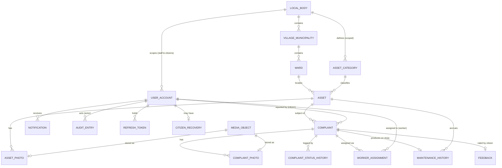

# CAMS — Conceptual / Logical Data Model

**Document:** `docs/architecture/DATA_MODEL.md`
**Version:** 1.0 (**TEAM-APPROVED**)
**Date:** 2026-09-04 · **Approved:** 2026-09-04 (architecture sign-off)
**Status:** 🟢 **TEAM-APPROVED** as part of decisions **AD-04** (hierarchy),
**AD-05** (complaint data), **AD-09** (media metadata), **AD-12** (audit),
**AD-15/16/17** (Secondary-entity isolation). Conceptual/logical level only —
**no SQL, no physical schema, no migrations here** (that is `TASKS.md` §6, from
this model). Requirements `REQUIREMENTS.md` v1.0 remains the source of truth.
**OQ-39 terminology stays OPEN** (see §2): the two-level *structure* is approved;
the working names `LocalBody` / `VillageOrMunicipality` may be renamed later without
a redesign.

Related: [`SYSTEM_ARCHITECTURE.md`](SYSTEM_ARCHITECTURE.md),
[`COMPLAINT_STATE_MACHINE.md`](COMPLAINT_STATE_MACHINE.md),
ADR-0004 (data hierarchy / OQ-39), ADR-0005 (state machine / OQ-38).

---

## 1. Modelling approach

- **Conceptual first:** entities, meaning, relationships, cardinalities.
- **Logical second:** attributes per entity with *intent* (not DB types), keys,
  and important constraints/invariants.
- Enumerations are listed once (§8) and referenced by name.
- Secondary-module entities (Inventory, Budget, SLA) are described in §9 and are
  **kept out of the MVP model** — they reference core entities **by id only** and
  add **only new tables**, never new columns on MVP tables.
- Retention/lifecycle rules (D18) are in §10.

---

## 2. OQ-39 — LocalBody vs Village/Municipality

**Question:** should `LocalBody` and `Village/Municipality` be two distinct
conceptual levels, or collapsed into one?

**Team decision (AD-04 / ADR-0004): keep BOTH levels — TWO-LEVEL STRUCTURE APPROVED.
The final *terminology* for these two levels is NOT settled — OQ-39 stays OPEN.**
Build against the structure using the working names `LocalBody` /
`VillageOrMunicipality`; a later naming decision is a rename, not a redesign.

| Level | Meaning (working definition) | Examples |
|-------|-------------------|----------|
| **LocalBody** | The governing administrative unit that operates CAMS for its area. | A Gram Panchayat; a Nagar Palika / Municipal Council. |
| **Village / Municipality** | A populated settlement unit administered by that LocalBody. A Panchayat can administer **several revenue villages**; a small municipality may have **one** such unit. | "Rampur village"; "Ward-cluster / township area". |
| **Ward** | Operational/electoral subdivision that assets and complaints are grouped by. | "Ward 1", "Ward 7". |

**Why keep both:** D19 explicitly names both; real Panchayats frequently cover
multiple villages; collapsing them would either lose that or force fake wards.
Keeping both costs one extra table and one extra FK.

**Not burdensome for a single-village body:** the Admin creates **one**
Village/Municipality record (named after the body) and puts all wards under it. The
app can hide the level in pickers when a LocalBody has exactly one
Village/Municipality (presentation only — the data still has it).

**This does not change D19.** If the team later decides one level is genuinely
redundant, that is a requirements change to be recorded, not a silent model edit.

---

## 3. Entity overview (MVP)

---

## 4. Entity catalog (MVP)

Notation: **PK** primary identifier · *FK* reference · `[enum]` see §8 · `?`
optional.

### 4.1 Organisation

**LOCAL_BODY** — a governing body operating CAMS.
- **PK** id
- name, code (short unique handle), type `[local_body_type]` (PANCHAYAT | MUNICIPALITY)
- active (bool; deactivate, never delete — D18)
- created_at, created_by *FK USER_ACCOUNT?*

**VILLAGE_MUNICIPALITY** — settlement unit under a LocalBody.
- **PK** id · *FK* local_body_id
- name, code?, active, created_at
- Constraint: (local_body_id, name) unique.

**WARD** — subdivision assets/complaints group by.
- **PK** id · *FK* village_municipality_id
- name, number?, centroid_lat?, centroid_lng? (optional, for map centring only —
  **not** a boundary; polygons are Secondary), active, created_at
- Derived scope: ward → village_municipality → local_body. `local_body_id` is
  **denormalised** onto ASSET/COMPLAINT for cheap scoping (see §6).

### 4.2 Users & auth

**USER_ACCOUNT**
- **PK** id
- role `[role]` (ADMIN | OFFICER | WORKER | CITIZEN) — **exactly one** per account (D1)
- full_name
- login_identifier — unique; for CITIZEN this is the **mobile number** (D16); for
  staff, a mobile number or username set by the Admin
- mobile_number? (citizens: = login_identifier; staff: optional contact)
- password_hash (algorithm + params embedded; see SECURITY §3) — **never plaintext (D18)**
- status `[account_status]` (ACTIVE | INACTIVE) — deactivation blocks login (D18, FR-AUTH-003/010)
- preferred_language `[language]` (EN | HI), default EN (D12, FR-AUTH-011)
- local_body_id *FK?* — set for OFFICER, WORKER, CITIZEN (their body); NULL for a
  deployment-global ADMIN (see §6 scoping)
- created_at, created_by *FK USER_ACCOUNT?* (Admin who created a staff account; NULL for self-registered citizens)
- deactivated_at?, deactivated_by *FK?*

**REFRESH_TOKEN** (auth session state — ADR-0006)
- **PK** id · *FK* user_account_id
- token_hash (opaque token stored hashed), issued_at, expires_at, revoked_at?,
  replaced_by *FK REFRESH_TOKEN?* (rotation chain), user_agent?/device_label?

**CITIZEN_RECOVERY** (optional, ADR-0007 — only if the "recovery code" option is adopted)
- **PK** user_account_id (1:1 with a CITIZEN account)
- recovery_code_hash, set_at, last_used_at?
- *If the team chooses staff-assisted-only recovery, this entity is not created.*

### 4.3 Assets

**ASSET_CATEGORY** (Admin-configurable — D23)
- **PK** id · *FK* local_body_id
- name, active, is_seed (bool; the 12 seeded defaults), created_at
- Constraint: (local_body_id, name) unique. Categories are **per LocalBody** so
  bodies don't share/clobber lists; each new LocalBody is seeded with the 12
  defaults (Street Light, Hand Pump, Water Tank, Public Toilet, Road, Drain,
  School, Community Hall, Park, Bench, Bus Stop, Dustbin).

**ASSET**
- **PK** id
- *FK* ward_id · *FK* asset_category_id · **denormalised** local_body_id (from ward)
- public_code — human-readable unique asset identifier (stable for life — FR-ASSET-002)
- status `[asset_status]` (WORKING | BROKEN | UNDER_MAINTENANCE | DECOMMISSIONED) — **operational** (D8)
- condition `[asset_condition]` (GOOD | FAIR | POOR | CRITICAL) — **physical**, independent of status (D24)
- latitude, longitude (decimal degrees — D13)
- installation_date
- warranty_provider?, warranty_reference?, warranty_expiry_date? (store only; alerts are Secondary — FR-ASSET-005)
- created_by *FK USER_ACCOUNT*, created_at, updated_at
- Invariant: 0–5 related ASSET_PHOTO rows (D25). `DECOMMISSIONED` is a status, not a
  row deletion; history is retained (FR-ASSET-009).

**ASSET_PHOTO**
- **PK** id · *FK* asset_id · *FK* media_object_id
- caption?, sort_order, uploaded_by *FK*, uploaded_at
- Invariant: ≤ 5 per asset.

### 4.4 Complaints & maintenance

**COMPLAINT**
- **PK** id
- *FK* asset_id (**required** — every MVP complaint is asset-linked, D3) · **denormalised** ward_id, local_body_id (from asset)
- reported_by *FK USER_ACCOUNT* (role CITIZEN — D2; proactive Officer/Worker creation is Secondary)
- description (required free text — D11)
- status `[complaint_status]` (PENDING | ASSIGNED | IN_PROGRESS | RESOLVED | VERIFIED | CLOSED | REJECTED — D7)
- priority `[complaint_priority]?` (LOW | MEDIUM | HIGH | CRITICAL) — NULL until an Officer sets it (D9)
- current_assignment_id *FK WORKER_ASSIGNMENT?* (the active assignment, if any)
- returned_count (int, default 0) — incremented on each rework RETURN (ADR-0005; supports D32 "tasks returned"). **No RETURNED status.**
- rejected_reason? (set only when status = REJECTED)
- submitted_at, updated_at, closed_at?
- Invariants: `REJECTED` only reachable from `PENDING`; cannot reach `RESOLVED`
  without ≥ 1 COMPLAINT_PHOTO of kind WORKER_COMPLETION (D11); see state machine.

**COMPLAINT_PHOTO**
- **PK** id · *FK* complaint_id · *FK* media_object_id
- kind `[complaint_photo_kind]` (CITIZEN_REPORT | WORKER_BEFORE | WORKER_COMPLETION)
- uploaded_by *FK*, uploaded_at
- Rules: CITIZEN_REPORT optional and 0–n (D11); WORKER_COMPLETION ≥ 1 required to leave IN_PROGRESS via resolve; WORKER_BEFORE optional.

**COMPLAINT_STATUS_HISTORY** (append-only)
- **PK** id · *FK* complaint_id
- from_status `[complaint_status]?`, to_status `[complaint_status]?`
- event_type `[complaint_event]` (SUBMIT | ASSIGN | REASSIGN | PRIORITY_SET | START | RESOLVE | RETURN | VERIFY | CLOSE | REJECT)
- actor_id *FK USER_ACCOUNT*, actor_role `[role]`
- note? (e.g. rejection/return reason, priority change note)
- occurred_at
- This is the authoritative timeline for a complaint and the source for resolution-time and "returned" metrics.

**WORKER_ASSIGNMENT** (assignment history — supports reassignment with history, FR-MAINT-002)
- **PK** id · *FK* complaint_id · *FK* worker_id (USER_ACCOUNT, role WORKER)
- assigned_by *FK USER_ACCOUNT* (Officer/Admin), assigned_at
- unassigned_at?, active (bool) — exactly one active assignment per complaint at a time
- reason? (for reassignment)

**MAINTENANCE_HISTORY** (created when a complaint reaches CLOSED — FR-HIST-001)
- **PK** id · *FK* asset_id · *FK* complaint_id (unique in MVP — one close → one entry)
- work_summary, remarks?, repair_cost (amount; currency assumed single-currency INR for MVP)
- worker_id *FK USER_ACCOUNT*
- resulting_status `[asset_status]`, resulting_condition `[asset_condition]` (snapshot set at close — D8/D24)
- completion_photo_ids (references to COMPLAINT_PHOTO of kind WORKER_COMPLETION)
- created_at
- Note: repair_cost captured here in MVP; **budget categorisation is Secondary** (§9).

### 4.5 Feedback

**FEEDBACK** (FR-FEED — D2, D17, D32)
- **PK** id · *FK* complaint_id (**unique** — one per complaint) · *FK* citizen_id (= complaint.reported_by)
- rating_value (integer, 1..`feedback.rating.max`; **max is config — OQ-37 open**, proposed default 5)
- feedback_text? (single, non-editable, **not a thread** — D17)
- submitted_at
- Rule: allowed only when complaint.status = CLOSED; not created for REJECTED.

### 4.6 Notifications & audit

**NOTIFICATION** (in-app only — D10)
- **PK** id · *FK* recipient_id (USER_ACCOUNT)
- type `[notification_type]`, title_key, body_params (small structured payload for localisation)
- related_entity_type `[entity_type]?`, related_entity_id?
- created_at, read_at?

**AUDIT_ENTRY** (append-only — D22, FR-AUDIT)
- **PK** id
- actor_id *FK USER_ACCOUNT?* (NULL only for system actions), actor_role `[role]?`
- action `[audit_action]` (e.g. ASSET_CREATE, ASSET_UPDATE, ASSET_DECOMMISSION,
  COMPLAINT_CREATE, COMPLAINT_UPDATE, COMPLAINT_STATUS_CHANGE, ASSIGNMENT_CHANGE,
  PRIORITY_CHANGE, COMPLAINT_VERIFY, COMPLAINT_CLOSE, COMPLAINT_REJECT,
  ACCOUNT_CREATE, ACCOUNT_DEACTIVATE, ACCOUNT_ROLE_CHANGE, PASSWORD_RESET,
  CATEGORY_CHANGE, LOCALBODY_CHANGE, WARD_CHANGE)
- entity_type `[entity_type]`, entity_id
- note?
- occurred_at (server time), request_id? (correlation)
- **No update/delete path** (SECURITY §9). Not written for routine navigation (D22).

### 4.7 Media

**MEDIA_OBJECT** (metadata; bytes live on the filesystem — ADR-0008)
- **PK** id
- storage_key (opaque path under media root), content_type, size_bytes,
  width?, height?, checksum
- purpose `[media_purpose]` (ASSET_PHOTO | COMPLAINT_PHOTO)
- uploaded_by *FK USER_ACCOUNT*, uploaded_at
- 1:1 with the ASSET_PHOTO / COMPLAINT_PHOTO row that references it.

---

## 5. Relationships & cardinality summary

| Relationship | Cardinality | Notes |
|--------------|-------------|-------|
| LocalBody → Village/Municipality | 1 → 0..* | D19 |
| Village/Municipality → Ward | 1 → 0..* | D19 |
| LocalBody → AssetCategory | 1 → 0..* | per-body list; seeded |
| Ward → Asset | 1 → 0..* | asset always in exactly one ward (FR-VILL-004) |
| AssetCategory → Asset | 1 → 0..* | |
| Asset → AssetPhoto | 1 → 0..5 | D25 |
| Asset → Complaint | 1 → 0..* | D3 (complaint requires an asset) |
| UserAccount(Citizen) → Complaint | 1 → 0..* | reporter |
| Complaint → ComplaintPhoto | 1 → 0..* | ≥1 WORKER_COMPLETION before RESOLVED |
| Complaint → ComplaintStatusHistory | 1 → 1..* | ≥1 (SUBMIT) always |
| Complaint → WorkerAssignment | 1 → 0..* | 0..1 active |
| UserAccount(Worker) → WorkerAssignment | 1 → 0..* | |
| Complaint → MaintenanceHistory | 1 → 0..1 | created at CLOSE (MVP) |
| Asset → MaintenanceHistory | 1 → 0..* | asset timeline |
| Complaint → Feedback | 1 → 0..1 | CLOSED only |
| UserAccount → Notification | 1 → 0..* | |
| UserAccount → AuditEntry (actor) | 1 → 0..* | |
| UserAccount → RefreshToken | 1 → 0..* | |
| UserAccount(Citizen) → CitizenRecovery | 1 → 0..1 | only if recovery-code option adopted |
| MediaObject → Asset/ComplaintPhoto | 1 → 1 | |

---

## 6. Scoping & multi-local-body strategy

- **Every scoped row carries `local_body_id`.** For assets/complaints it is
  **denormalised** from the ward chain so list/queue queries filter by one indexed
  column (important because Officers see the *whole* local body — D6 — and load is
  unknown, OQ-14).
- **Access rule (enforced in the API, SECURITY §4):**
  - ADMIN: `local_body_id` NULL ⇒ deployment-global operator (creates local bodies,
    staff, categories). *(PROPOSED; a per-body admin scoping is a Future
    refinement, not required by D1.)*
  - OFFICER: full read/write within their `local_body_id`; ward filter is a query
    parameter, not a permission boundary (D6).
  - WORKER: only rows where they are the **assigned worker** (D28); no local-body-
    wide read.
  - CITIZEN: only their own complaints + read-only asset/map within their local
    body.
- **Demo deployment:** one LocalBody, one (or few) Village/Municipality, several
  Wards. Nothing is hardcoded — swapping in another body is data entry only
  (NFR-SCAL-001).

---

## 7. Complaint state data

The allowed values and transitions live in
[`COMPLAINT_STATE_MACHINE.md`](COMPLAINT_STATE_MACHINE.md). Data-model points:

- `COMPLAINT.status` holds the current state; history is in
  `COMPLAINT_STATUS_HISTORY`.
- **Rework return (OQ-38):** modelled as a `COMPLAINT_STATUS_HISTORY` row with
  `event_type = RETURN`, `from_status = RESOLVED`, `to_status = IN_PROGRESS`, plus
  `COMPLAINT.returned_count += 1`. **No `RETURNED` status value** — the D7 set is
  used verbatim (ADR-0005).
- Resolution time = `closed_at − submitted_at` (from history if `closed_at` absent).
- "Tasks returned" per worker = count of RETURN events on complaints where that
  worker held the active assignment (or `sum(returned_count)` over their complaints).

---

## 8. Enumerations (single source)

| Enum | Values | Basis |
|------|--------|-------|
| `role` | ADMIN, OFFICER, WORKER, CITIZEN | D1 |
| `account_status` | ACTIVE, INACTIVE | FR-AUTH-003/010, D18 |
| `language` | EN, HI | D12 |
| `local_body_type` | PANCHAYAT, MUNICIPALITY | D19 (descriptive) |
| `asset_status` | WORKING, BROKEN, UNDER_MAINTENANCE, DECOMMISSIONED | **D8** |
| `asset_condition` | GOOD, FAIR, POOR, CRITICAL | **D24** |
| `complaint_status` | PENDING, ASSIGNED, IN_PROGRESS, RESOLVED, VERIFIED, CLOSED, REJECTED | **D7** |
| `complaint_priority` | LOW, MEDIUM, HIGH, CRITICAL | **D9** |
| `complaint_event` | SUBMIT, ASSIGN, REASSIGN, PRIORITY_SET, START, RESOLVE, RETURN, VERIFY, CLOSE, REJECT | ADR-0005 |
| `complaint_photo_kind` | CITIZEN_REPORT, WORKER_BEFORE, WORKER_COMPLETION | D11 |
| `notification_type` | COMPLAINT_SUBMITTED, COMPLAINT_ASSIGNED, COMPLAINT_STARTED, COMPLAINT_RESOLVED, COMPLAINT_RETURNED, COMPLAINT_VERIFIED, COMPLAINT_CLOSED, COMPLAINT_REJECTED | D10, FR-NOTIF |
| `audit_action` | see AUDIT_ENTRY (§4.6) | D22 |
| `entity_type` | LOCAL_BODY, VILLAGE_MUNICIPALITY, WARD, ASSET_CATEGORY, ASSET, COMPLAINT, WORKER_ASSIGNMENT, MAINTENANCE_HISTORY, FEEDBACK, USER_ACCOUNT | — |
| `media_purpose` / `media_purpose` | ASSET_PHOTO, COMPLAINT_PHOTO | — |

Asset categories are **data**, not an enum (Admin-configurable — D23).
`feedback.rating.max` is **config**, not an enum (OQ-37).

---

## 9. Secondary-module entities (isolated — NOT in the MVP model)

Described for completeness and to prove isolation. **Do not build for MVP.** Each
references core rows by id; adding them is "new tables only".

**Inventory (D29 — one central store for MVP-of-this-module):**
- `INVENTORY_ITEM(id, local_body_id, name, unit, low_stock_threshold, active)`
- `STOCK_MOVEMENT(id, inventory_item_id, change_qty, reason[RECEIPT|ADJUSTMENT|CONSUMPTION], complaint_id?, occurred_by, occurred_at)`

**Budget / expenditure (D30, D31):**
- `EXPENDITURE_ENTRY(id, complaint_id, category[LABOR|MATERIAL|TRANSPORT|OTHER], amount, recorded_by, recorded_at, note?)`
- `BUDGET_ALLOCATION(id, scope_type[WARD|CATEGORY|LOCAL_BODY], scope_id, period_start, period_end, allocated_amount)`
- "spent" and "remaining" are computed from EXPENDITURE_ENTRY; no denormalised
  balance on MVP tables.

**SLA (D34):**
- `SLA_TARGET(id, local_body_id, priority[complaint_priority], target_hours)`
- target-vs-actual is computed from `COMPLAINT_STATUS_HISTORY`; **no** column added
  to COMPLAINT, **no** escalation.

**Isolation guarantees:**
1. No MVP table gains a column for these.
2. Core modules never import Secondary packages.
3. Feature flags keep the tables uncreated / endpoints unrouted until enabled.

---

## 10. Data lifecycle & retention (D18)

| Data | Rule |
|------|------|
| LocalBody / Village / Ward / Category | **Deactivate, never hard-delete** while referenced. `active = false` hides from pickers; history stays valid. |
| Asset | `DECOMMISSIONED` status retires it; row + photos + history retained. Hard delete = Admin-only, blocked/confirmed + audited when history exists (FR-ASSET-012, Secondary). |
| Complaint / status history / assignments / maintenance history | **Retained for the deployment lifetime.** Citizens **cannot** delete their complaints (FR-COMP-011). |
| Feedback | Retained; not editable after submit (FR-FEED-004). |
| User account | Deactivate (default). Hard deletion of a user / personal data = explicit **audited** Admin action (FR-AUTH-010); by default name/mobile retained (D18). If a user is ever hard-deleted, referencing rows keep the id; display falls back to "removed user" (no anonymisation logic is promised beyond that). |
| Audit entries | Append-only; retained for the deployment lifetime; never edited/deleted via the app. |
| Refresh tokens | Short-lived; expired/rotated tokens pruned by housekeeping (not user data). |
| Media | Retained with its owning row; included in every backup (D36). |
| Privacy statement | Shown in-app (FR-AUTH-009); this model collects only name, mobile, description text, photos, location (NFR-SEC-004). |

---

## 11. Indexing & volume notes (OQ-14 OPEN — no numbers claimed)

Indexing intent (physical detail deferred to schema design):
- `ASSET(local_body_id, ward_id, category_id, status)` and `(latitude, longitude)`
  for map bbox queries.
- `COMPLAINT(local_body_id, status, ward_id, priority)`, `COMPLAINT(reported_by)`,
  `COMPLAINT(current_assignment_id)`.
- `WORKER_ASSIGNMENT(worker_id, active)`.
- `COMPLAINT_STATUS_HISTORY(complaint_id, occurred_at)`.
- `NOTIFICATION(recipient_id, read_at)`.
- `AUDIT_ENTRY(occurred_at)`, `(entity_type, entity_id)`, `(actor_id)`.

Growth watch (SYSTEM_ARCHITECTURE §15): `complaint_status_history`, `audit_entry`,
`media_object` grow fastest. All are append-only and index-friendly; partitioning
is a **later** option if OQ-14 shows it is needed — not an MVP concern.

---

## 12. Validation checklist (this document)

| Check | Result |
|-------|--------|
| Hierarchy matches D19 (`LocalBody → Village/Municipality → Ward → Asset → Complaint`) | ✅ §3, §4.1 |
| OQ-39 addressed, D19 not silently changed | ✅ §2 (keep both levels; guidance + ADR-0004) |
| Asset **status** and **condition** are separate fields with the D8/D24 value sets | ✅ §4.3, §8 |
| Complaint states = exactly D7; no invented states; rework = event (OQ-38) | ✅ §7, §8, ADR-0005 |
| Every complaint links an asset (D3) | ✅ ASSET_ID required |
| Worker isolation representable (assigned-only) | ✅ WORKER_ASSIGNMENT + §6 rule |
| Citizen feedback = 1 per CLOSED complaint, non-thread (D17) | ✅ §4.5 |
| In-app notifications only (D10) | ✅ NOTIFICATION has no channel/external fields |
| Audit fields = actor/action/time/entity/note (D22) | ✅ §4.6 |
| Media included in backup (D36) | ✅ MEDIA_OBJECT + filesystem, §10, ADR-0008/0010 |
| Multi-local-body, nothing hardcoded (NFR-SCAL-001) | ✅ §6 |
| Passwords never plaintext (D18) | ✅ `password_hash` only |
| Secondary entities isolated, no MVP-table contamination | ✅ §9 |
| No capacity numbers invented (OQ-14) | ✅ §11 |

---

## 13. Open items carried by the data model

| ID | Item | Effect on model | Status |
|----|------|-----------------|--------|
| **OQ-39** | LocalBody vs Village/Municipality **terminology** | Two-level structure approved (AD-04). Working names `LocalBody` / `VillageOrMunicipality`; a rename later is not a redesign. | **OPEN** (terminology only) |
| **OQ-38** | Rework representation | Approach approved (AD-05): `RETURN` event + `returned_count`, no `RETURNED` state. Residual: return-reason taxonomy, UI "returned" indicator. | **OPEN** (residual only) |
| **OQ-37** | Rating scale | `feedback.rating.max` is config; `rating_value` stored as int. Default proposed 5. | **OPEN** |
| **OQ-14** | Volumes | Indexing intent only; partitioning deferred (AD-23 / ADR-0019). | **OPEN** |
| **OQ-41** | SLA target values | `sla_target` table shape only; no values. Secondary. | **OPEN** |
| **OQ-42** | Citizen recovery request persistence | ADR-0007's staff-assisted flow (`POST /auth/citizen/recovery/request` → staff `.../resolve`) implies a pending-request record; this model defines none (`CITIZEN_RECOVERY` above is only the separate, optional recovery-code supplement). Unresolved: (A) no persisted record — manual office process — vs (B) persist requests, which requires this document to first define the entity/lifecycle/fields/retention rules. Neither chosen here. | **OPEN** (identified 2026-09-12, during the baseline-schema architecture review — not part of the 2026-09-04 sign-off) |
| Currency | INR single-currency assumed for `repair_cost` / expenditure (student MVP, one country). Not a stated requirement — flag for confirmation. | minor |
| Staff `login_identifier` | Mobile vs username for staff not fixed by requirements — team choice at build. | minor |

---

## 14. Change log

| Version | Date | Notes |
|---------|------|-------|
| 0.1 (PROPOSED) | 2026-09-04 | Initial conceptual/logical model for Requirements v1.0. OQ-39/OQ-38 given an architectural approach; Secondary entities isolated; retention rules from D18. No SQL. |
| **1.0 (TEAM-APPROVED)** | 2026-09-04 | Team sign-off (AD-04, AD-05, AD-09, AD-12, AD-15/16/17). **OQ-39 terminology and OQ-38 residual explicitly kept OPEN** — the *structure* and the *approach* are approved, the naming/detail are not. No SQL, no schema, no code. |
