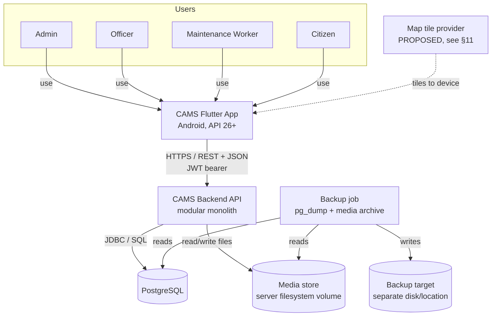
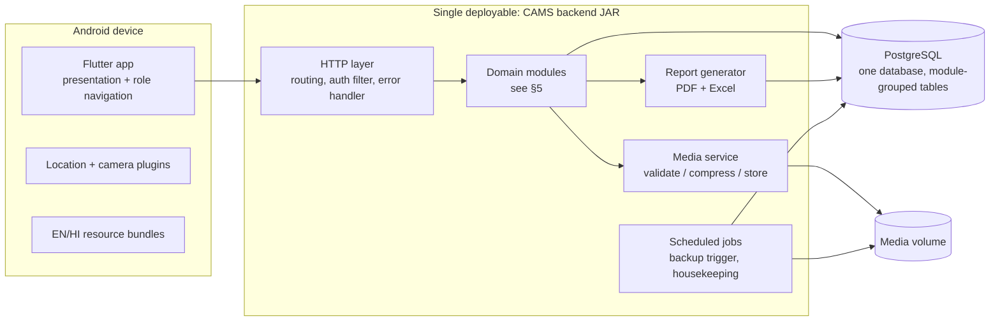
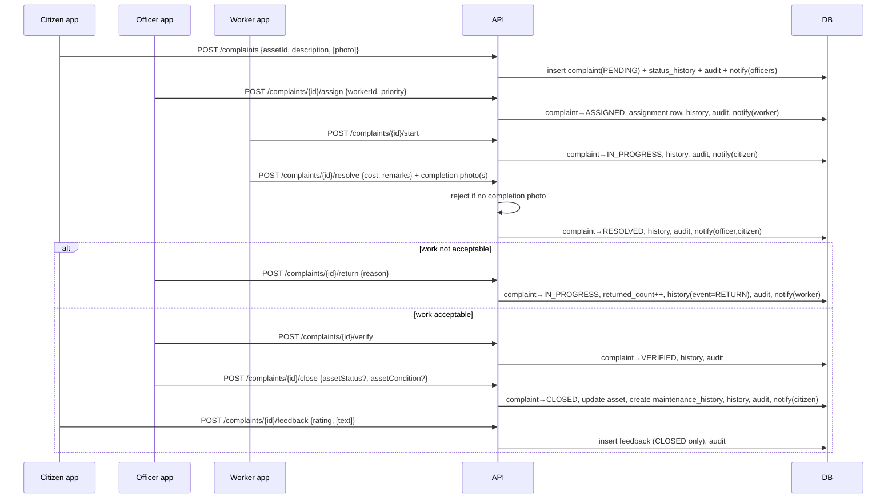

# CAMS — System Architecture

**Document:** `docs/architecture/SYSTEM_ARCHITECTURE.md`
**Version:** 1.0 (**TEAM-APPROVED**)
**Date:** 2026-09-04 · **Approved:** 2026-09-04 (CAMS architecture sign-off)
**Status:** 🟢 **TEAM-APPROVED.** The architecture decisions in this document and its
companions are approved as team decisions **AD-01 … AD-25** (§1A), recorded as ADRs
0001–0019 in `docs/decisions/` and in `PLAN.md` §4. Requirements
`REQUIREMENTS.md` v1.0 (BASELINE) remains the source of truth; this document does
not change or reinterpret a requirement. **Implementation has not started** and is
gated behind the environment / prerequisite readiness step (`TASKS.md` §1).
Genuinely unresolved requirements questions are preserved as OPEN (§15, §16, §21).

Companion documents: [`DATA_MODEL.md`](DATA_MODEL.md),
[`API_ARCHITECTURE.md`](API_ARCHITECTURE.md),
[`SECURITY_ARCHITECTURE.md`](SECURITY_ARCHITECTURE.md),
[`COMPLAINT_STATE_MACHINE.md`](COMPLAINT_STATE_MACHINE.md).

---

## 1A. Approved architecture decisions (AD-01 … AD-25)

Team-approved at the 2026-09-04 architecture sign-off. "OQ" = a requirements
question deliberately kept OPEN.

| AD | Decision (summary) | ADR / doc | OPEN item kept |
|----|--------------------|-----------|----------------|
| AD-01 | Java 21 LTS + Spring Boot + Maven + PostgreSQL + Flyway | ADR-0001 | — |
| AD-02 | Modular monolith; one deployable; service-interface boundaries; **no microservices** | ADR-0002 | — |
| AD-03 | REST/JSON, `/api/v1`; REST resources for CRUD; action sub-resources for complaint transitions; consistent validation/errors | ADR-0003, API doc | — |
| AD-04 | `LocalBody → Village/Municipality → Ward → Asset → Complaint → Maintenance`; multi-local-body; never hardcoded to one village | ADR-0004, DATA_MODEL | **OQ-39** (final terminology) |
| AD-05 | D7 lifecycle + `PENDING→REJECTED`; **no `RETURNED` status**; `RESOLVED→IN_PROGRESS` for rework + history event + `returned_count` | ADR-0005, STATE_MACHINE | **OQ-38** (residual detail) |
| AD-06 | Spring Security; **Argon2id** hashing (BCrypt fallback); short JWT access + rotating refresh; server-side; never plaintext | ADR-0006 | — |
| AD-07 | Server-side RBAC (ADMIN/OFFICER/WORKER/CITIZEN); enforced on backend; UI is not a security boundary | ADR-0012, SECURITY §4 | — |
| AD-08 | Staff-assisted citizen password reset = safe MVP default; no secure self-service claim | ADR-0007 | **OQ-40** |
| AD-09 | Server-side filesystem/object-like media + DB metadata; upload validation + re-encode + EXIF strip; no mandatory AV | ADR-0008, SECURITY §7 | — |
| AD-10 | Flutter OSM-based map; store lat/long + Ward ID; no PostGIS; no ward polygons; markers filter+lookup | ADR-0013 | tile-provider/licensing |
| AD-11 | In-app notifications persisted in PostgreSQL + client polling; **no SMS/WhatsApp/email** | ADR-0009 | — |
| AD-12 | Audit trail for important business/security actions (actor/action/record/time/note); not every click | ADR-0014, SECURITY §9 | — |
| AD-13 | Server-side PDF + Excel reports (Apache POI + OpenPDF/simple PDF); Complaint report + Asset register | ADR-0011 | — |
| AD-14 | Backend SQL aggregation for analytics; Flutter `fl_chart`; no separate analytics platform | ADR-0015 | — |
| AD-15 | Inventory = Secondary; one central store initially | ADR-0016 | — |
| AD-16 | Budget = Secondary; allocated / actual / remaining; worker cost ≠ officer official expenditure | ADR-0016 | — |
| AD-17 | SLA = reporting-only; no auto-escalation in MVP | ADR-0016 | **OQ-41** (target values) |
| AD-18 | Nightly PostgreSQL + media backup; ≥7-day retention; separate location; tested restore; MANIFEST/checksums | ADR-0010 | — |
| AD-19 | Single host (app + PostgreSQL + media); HTTPS/TLS; no k8s/orchestration; SPOF documented | ADR-0017 | **OQ-17** (availability) |
| AD-20 | Riverpod for Flutter state management | ADR-0018 | — |
| AD-21 | MVP is **online-only**; offline + sync = Future | ADR-0017, D4 | — |
| AD-22 | Baseline the existing security architecture (TLS, hashing, JWT/refresh, RBAC, input & upload validation, media re-encode/EXIF, audit, rate limiting, safe errors); no dedicated AV in MVP | SECURITY_ARCHITECTURE.md (APPROVED) | — |
| AD-23 | Performance baseline: pagination, indexes, efficient queries, connection pooling, bounded/bbox map queries, bounded payloads | ADR-0019 | **OQ-14** (scale numbers) |
| AD-24 | Six-member ownership model retained (§17); everyone still understands the whole system | §17 | — |
| AD-25 | AI is **not foundational**; core workflow independent of AI; listed AI features are Future/Secondary and must never block the MVP | ADR-0016 | — |

---

## 1. Architectural drivers (from Requirements v1.0)

| Driver | Source | Architectural implication |
|--------|--------|---------------------------|
| One Flutter mobile app for all four roles; Android-first, API 26+ | D5, D26 | Single client; role-aware UI; no web client to design for in MVP. |
| Backend + PostgreSQL; framework still PROPOSED | D36, PLAN §3 | Choose a backend a 6-person student team can build/test/explain (ADR-0001). |
| Online-only MVP | D4 | No local persistence/sync layer; app assumes connectivity; clean offline-error UX only. |
| Multi-local-body data model, not hardcoded to one village | D19 | `LocalBody → Village/Municipality → Ward` hierarchy; every scoped row carries a local-body scope. |
| Four roles, whole-local-body Officer scope, worker data isolation | D1, D6, D28 | Server-side RBAC + local-body scoping + owner checks on every complaint query/action. |
| Complaint lifecycle fixed (7 states) + rework return | D7, D32, OQ-38 | Explicit state machine; "return" modelled as an event, not a new state (ADR-0005). |
| Asset status ≠ asset condition | D8, D24 | Two independent enumerated fields on Asset. |
| Photos: assets 1–5, citizen optional, worker completion mandatory, compressed, in backups | D11, D25, D36 | Media subsystem with validation + client/server compression; storage that backs up with the DB (ADR-0008). |
| In-app notifications only | D10 | Stored `Notification` rows + client polling; no SMS/email/push. |
| Audit log of important actions | D22 | Append-only `AuditEntry`; written in the same transaction as the change. |
| PDF + Excel reports (Complaint, Asset register) | D33 | Server-side generation with a reporting library; two report types for MVP. |
| Daily backup, ≥7-day retention, tested restore; manual acceptable | D36 | `pg_dump` + media archive on a schedule; documented restore runbook. |
| Rural-friendly, English + Hindi | D12, D27 | i18n from day one; large-target UI; server returns codes, client localises. |
| MVP / Secondary / Future separation | REQUIREMENTS §13–§14 | Modular monolith with Secondary modules (Inventory, Budget, SLA) isolated behind their own package + tables (ADR-0002). |
| Scale (OQ-14) and availability (OQ-17) undecided | §15.3 | Keep sizing-sensitive choices flexible; define what to measure; invent no numbers. |

---

## 2. Context view



**Trust boundary:** the device and the map tile provider are outside trust; the API,
DB, media store, and backup target are inside. All rules (RBAC, scoping, validation,
state transitions) are enforced in the API — never trusted from the client.

---

## 3. Container view



One process, one database, one media volume. No message broker, no separate
services, no container orchestration required for MVP.

---

## 4. Architecture style

**PROPOSED (ADR-0002): a modular monolith.**

- One backend process and one database. Code is split into **modules** (§5) with
  clear ownership and minimal cross-module calls (through published interfaces, not
  each other's tables).
- Rationale: the MVP is a single connected workflow (asset → complaint → repair →
  close → history) with modest, unknown load (OQ-14). Microservices would add
  network calls, distributed transactions, deployment machinery, and observability
  needs that a 6-person student team cannot build, test, or explain in the time
  available, for no functional benefit.
- Secondary modules (Inventory, Budget/Expenditure, SLA) live in their own packages
  and their own tables and are compiled in but **feature-flagged off** for MVP.
  They reference core entities by id only, so they can be switched on later without
  reshaping MVP tables.
- Future (offline sync, QR, AI, web dashboard, external channels) are **not**
  designed here; the module boundaries and the REST API are the extension points.

---

## 5. Backend module map

| Module | MVP? | Responsibility | Owns (tables) | Depends on |
|--------|------|----------------|---------------|------------|
| **Auth/User** | MVP | Login, token issue/refresh/revoke, password hashing, role assignment, account activation/deactivation, staff password reset, citizen recovery flow, `/me`, language preference. | `user_account`, `refresh_token`, `citizen_recovery` | — |
| **LocalBody/Ward** | MVP | CRUD for `LocalBody → Village/Municipality → Ward`; provides scope resolution used by every other module. | `local_body`, `village_municipality`, `ward` | Auth (for actor) |
| **Asset Category** | MVP | Admin-configurable category list per local body; seed defaults. | `asset_category` | LocalBody |
| **Asset** | MVP | Register/edit/decommission assets; asset attributes incl. status & condition; asset list/filter; map-marker projection; asset photo management (1–5). | `asset`, `asset_photo` | LocalBody, Asset Category, Media, Audit |
| **Complaint** | MVP | Citizen complaint creation (asset-linked), complaint queue (role-scoped), complaint detail, status history, priority, rejection. Hosts the **state machine**. | `complaint`, `complaint_photo`, `complaint_status_history` | Asset, Auth, Notification, Audit, Media |
| **Maintenance** | MVP | Worker assignment/reassignment, start, resolve (mandatory completion photo + cost + remarks), officer return/verify/close, asset status/condition update on close, maintenance-history creation. | `worker_assignment`, `maintenance_history` | Complaint, Asset, Notification, Audit, Media |
| **Feedback** | MVP | One citizen rating (+ optional one-time note) per CLOSED complaint; exposes rating for analytics and for the owning worker. | `feedback` | Complaint, Auth |
| **Notification** | MVP | Create in-app notifications on domain events; list/unread-count/mark-read per recipient. | `notification` | (consumes events from Complaint/Maintenance) |
| **Audit** | MVP | Append-only recording of important actions with actor/action/time/entity/note; Admin query. | `audit_entry` | (written by all mutating modules) |
| **Reporting/Analytics** | MVP | Basic counts (asset status/condition, complaint counts by status/ward/category/priority); generate Complaint report and Asset register report as PDF/Excel. | (read-only across modules) | Asset, Complaint |
| **Media** | MVP | Validate uploads (type/size/dimensions), strip EXIF, server-side re-compress, store to media volume, stream on authorised read. | `media_object` (metadata) + filesystem | Auth (authorise reads) |
| **Inventory** | SECONDARY (isolated) | Items, single central store, stock movements, low-stock flag. | `inventory_item`, `stock_movement` | references Complaint/Asset by id |
| **Budget/Expenditure** | SECONDARY (isolated) | Officer-recorded categorised expenditure; budget allocation vs spent vs remaining. | `expenditure_entry`, `budget_allocation` | references Complaint/Ward by id |
| **SLA** | SECONDARY (isolated) | Configurable target time per priority; target-vs-actual reporting (no escalation). | `sla_target` | reads Complaint timings |

**Cross-module rule (PROPOSED):** a module may call another module's **service
interface**; it may not read or write another module's tables. Analytics/Reporting
is the one read-only exception and uses dedicated read queries/views.

---

## 6. Component responsibilities (detail)

- **HTTP layer:** routing, request/response (JSON), authentication filter (validate
  JWT, load principal: `userId`, `role`, `localBodyId`), centralised error handling
  (uniform error body), request-size limits, `Accept-Language` pass-through.
- **Auth/User:** BCrypt/Argon2 hashing (ADR-0006); short-lived access JWT + rotating
  server-stored refresh token; deactivation checked on refresh so a disabled account
  loses access within one access-token lifetime; staff reset by Admin; citizen
  recovery per ADR-0007.
- **LocalBody/Ward:** the hierarchy and the authoritative **scope** for a row. Every
  scoped entity (asset, complaint, …) carries `local_body_id` (denormalised) so
  queries can filter by scope cheaply.
- **Asset:** enforces 1–5 photos; `status ∈ {WORKING, BROKEN, UNDER_MAINTENANCE,
  DECOMMISSIONED}` and `condition ∈ {GOOD, FAIR, POOR, CRITICAL}` as two
  independent fields; `DECOMMISSIONED` is a status value, not a delete.
- **Complaint + Maintenance:** together implement WF-3. The state machine
  ([`COMPLAINT_STATE_MACHINE.md`](COMPLAINT_STATE_MACHINE.md)) is the single source
  of truth for allowed transitions, actor, recorded data, notification, and audit
  event. Every transition writes a `complaint_status_history` row **and** an
  `audit_entry` **and** the relevant `notification` rows, in one DB transaction.
- **Feedback:** one row per complaint (unique), only when `status = CLOSED`,
  `rating` bounded by a config value (`feedback.rating.max`, default proposed 5 —
  **OQ-37 open**), optional `feedback_text` (single, non-editable, not a thread).
- **Notification:** simple fan-out inside the monolith — the transacting module
  calls `NotificationService.notify(recipientId, type, refs)`; rows are delivered by
  the app polling `GET /notifications`.
- **Audit:** actor and timestamp always taken from the server context, never the
  client. No update/delete path is exposed.
- **Reporting/Analytics:** synchronous generation for MVP volumes; Complaint report
  and Asset register report only; PDF via a Java PDF library, Excel via Apache POI
  (ADR-0011).
- **Media:** the only component touching the filesystem; returns opaque
  `storage_key`s; reads are authorised (asset/complaint visibility rules apply).
- **Scheduled jobs:** trigger/verify the nightly backup (ADR-0010); optional
  housekeeping (e.g. prune expired refresh tokens).

---

## 7. Cross-cutting concerns

- **Transactions & consistency:** one relational DB; each request that mutates state
  runs in a single transaction covering domain change + status history + audit +
  notifications. No eventual consistency, no outbox needed for MVP.
- **Domain events (in-process):** modules publish simple in-process events
  (`ComplaintAssigned`, `ComplaintResolved`, …) that Notification/Audit listeners
  consume synchronously within the same transaction. This keeps Complaint/
  Maintenance code free of notification/audit detail without adding a broker.
- **i18n:** all user-facing text is keyed; the server sends stable **codes**
  (status, condition, priority, error keys, notification type) and the app renders
  EN/HI. Free text (descriptions, remarks) is stored as entered.
- **Validation:** request DTOs validated at the HTTP boundary (required fields,
  ranges, enum membership, photo counts); domain invariants (e.g. "completion photo
  present before RESOLVE") enforced in the module service.
- **Configuration:** all environment-specific values (DB URL/credentials, JWT
  signing key, media path, backup target, feature flags, `feedback.rating.max`,
  page-size caps) come from external configuration / environment variables, never
  from source (see SECURITY_ARCHITECTURE §12).
- **Error model:** uniform JSON error `{ "error": "<code>", "message": "<dev text>",
  "details": [...] }`; the app maps `error` codes to localised messages.

---

## 8. Key runtime flows

### 8.1 Complaint: submit → close (WF-3)



### 8.2 Photo upload
App captures → downscales/compresses on device (target long-edge + quality from
config) → `multipart` to API → Media service checks magic bytes, MIME, size cap,
max dimensions, re-encodes (strips EXIF/GPS), writes to
`<media-root>/<entity>/<yyyy>/<mm>/<uuid>.<ext>`, records `media_object` → returns
metadata. Retrieval is `GET /media/{key}` with the same visibility rules as the
owning entity.

### 8.3 Report generation
Officer/Admin `POST /reports/{type}` with filters + `format` → Reporting module runs
read queries → streams `application/pdf` or the XLSX media type. Synchronous for MVP
volumes; a job-id/async variant is a documented later option if reports grow.

### 8.4 Notification delivery
App polls `GET /notifications/unread-count` on a modest interval and
`GET /notifications` when the user opens the bell. No server push in MVP.

---

## 9. Technology stack (PROPOSED)

| Layer | Choice | Fixed by | ADR |
|-------|--------|----------|-----|
| Mobile app | **Flutter** (stable channel), Dart | D5 | ADR-0001 |
| Min platform | **Android 8.0 / API 26**; iOS deferred | D26 | — |
| App state mgmt | **PROPOSED:** a single documented approach (e.g. Riverpod *or* Bloc) — team picks one and records it; not decided here | — | ADR-0001 (frontend note) |
| Backend | **PROPOSED: Java + Spring Boot** | — (was proposed) | ADR-0001 |
| Java runtime | **PROPOSED: JDK 21 (LTS)** — not JDK 24 (non-LTS, weaker library/tool support) | — | ADR-0001 |
| Build tool | **PROPOSED: Maven** (predictable, ubiquitous docs) | — | ADR-0001 |
| Persistence | Spring Data JPA / Hibernate over **PostgreSQL** | D36 | ADR-0001 |
| DB migrations | **PROPOSED: Flyway** (plain SQL migrations, easy to explain) | — | ADR-0001 |
| Security | Spring Security; JWT (access) + rotating refresh; BCrypt/Argon2 | — | ADR-0006 |
| Excel | **Apache POI** | — | ADR-0011 |
| PDF | **PROPOSED: OpenPDF** (LGPL/MPL) or a template engine → HTML → PDF | — | ADR-0011 |
| Media | Server filesystem volume + metadata table | — | ADR-0008 |
| Map | Device-side map widget + tile provider (see §11) | D13 | ADR (map) — see §11 |
| Tests | JUnit 5, Spring MockMvc, **Testcontainers-PostgreSQL** for integration; Flutter `flutter_test` + golden tests | NFR-MAINT-001 | ADR-0001 |
| Packaging | Single executable Spring Boot JAR | — | ADR-0002 |

Nothing above overrides a requirement; items marked PROPOSED are for team sign-off.

---

## 10. Deployment view (MVP / demo)

```
[ Android device(s) ]  --HTTPS-->  [ CAMS backend JAR ]  --local socket-->  [ PostgreSQL ]
                                          |  reads/writes
                                          v
                                   [ media volume (disk dir) ]
                                          ^
                                   [ nightly backup job ] --> [ backup target: separate disk / external drive / institute storage ]
```

- **One host** (an institute server, a low-cost VM, or a lab machine reachable by
  the demo devices). Backend JAR + PostgreSQL + media directory on that host.
- **TLS** terminates at the backend or a thin reverse proxy in front of it
  (proxy optional for MVP; TLS is not).
- **Environments:** `local` (each developer: local PostgreSQL + JAR), `demo`
  (the shared host). No staging required for MVP; add if time permits.
- **Config** per environment via environment variables / an untracked
  `application-<env>.properties` (already covered by `.gitignore`).
- **No** container orchestration, load balancer, or clustering in MVP (see §16).

---

## 11. Map / GIS

**Approved — AD-10 / ADR-0013 (requirement basis D13):** assets store `latitude`,
`longitude`, and a `ward_id`; the app shows an **interactive marker map** using an
**OpenStreetMap-based** Flutter map; **no PostGIS** and **no ward-boundary
polygons** in MVP.

- The **map widget runs on the device**. The backend never renders tiles or does
  spatial math for MVP — it stores and returns plain lat/long.
- `GET /assets?view=map&bbox=…&...filters` returns a lightweight, bounding-box-
  bounded, `maxMarkers`-capped list of `{id, lat, lng, category, status}`; tapping
  a marker calls `GET /assets/{id}`. Markers support filtering + lookup.
- Location capture uses the device GPS or a draggable pin; the app sends the final
  lat/long on create/edit (`FR-GIS-003`).
- **OPEN sub-item (tracked):** the exact **tile provider / licensing / usage
  terms** is not yet resolved (an OSM tile source with acceptable terms, a
  self/institute-hosted tile cache, or a commercial SDK). It must be settled before
  the map screens are built. This is **not** an external *integration* in the D20
  sense (only tiles to the device, no CAMS data leaves). Fallback if no acceptable
  tile source: a coordinate list + "open in device maps" link.
- If a Secondary feature later needs polygons or radius search, PostGIS can be
  added without touching MVP tables (new columns/tables only).

---

## 12. Notifications

**Approved (D10): in-app only. No SMS, WhatsApp, email.**

- **Model:** `notification(id, recipient_id, type, title_key, body_params,
  related_entity_type, related_entity_id, created_at, read_at)`.
- **Creation:** synchronous, inside the triggering transaction, via
  `NotificationService`. Events and recipients for MVP:

  | Event | Recipients |
  |-------|-----------|
  | Complaint submitted | all Officers of the local body |
  | Assigned / reassigned | the (new) Worker |
  | Started (IN_PROGRESS) | the Citizen |
  | Resolved | the assigning Officer + the Citizen |
  | Returned for rework | the Worker |
  | Rejected / Verified / Closed | the Citizen |

- **Delivery:** the app polls `GET /notifications/unread-count` and lists via
  `GET /notifications`; `POST /notifications/{id}/read` and `/read-all`.
- **Explicitly not in MVP:** OS push (FCM/APNs) is a *different mechanism* from the
  approved "in-app" requirement and is **Future**. If the team later wants push,
  it is an additive delivery channel on the same `notification` rows and needs its
  own decision (and would touch D10).

---

## 13. Reporting

**Approved (D33): Complaint report + Asset register report, as PDF and Excel.**

- **Server-side generation** (the app cannot produce Excel reliably and reports may
  be shared/printed from a desktop).
- **Complaint report:** filter by period + status + ward + category + priority;
  columns e.g. complaint id, asset, ward, category, status, priority, submitted,
  closed, resolution days, worker, cost, rating.
- **Asset register report:** filter by ward + category + status + condition;
  columns e.g. asset code, category, ward, status, condition, install date, #open
  complaints, last maintenance date.
- **Excel:** Apache POI, one sheet per report, a header block with the filter
  values.
- **PDF:** a simple tabular layout (library-drawn table or HTML→PDF). No pixel-
  perfect templating for MVP.
- **Analytics** (`FR-ANLY-001/002`) are JSON endpoints powering on-screen counts;
  they share the same read queries as the reports.
- Kept deliberately simple; advanced/scheduled reports are Secondary.

---

## 14. Backup / restore

**Approved (D36): daily PostgreSQL backup, ≥7-day retention, media included,
restore tested before final evaluation; manual/documented acceptable initially.**

**PROPOSED (ADR-0010):**

- **What is backed up:**
  1. **Database** — `pg_dump` (custom/compressed format) of the CAMS database.
  2. **Media volume** — a `tar`/zip of `<media-root>`.
  3. A short `MANIFEST` (timestamp, DB version, schema/migration version, file
     counts, checksums).
- **Schedule:** nightly, via OS cron / a scheduled task on the host (or a
  `@Scheduled` trigger that shells out). Manual run is documented for the demo host.
- **Naming/retention:** `cams-backup-YYYYMMDD-HHMM/{db.dump, media.tar, MANIFEST}`;
  keep **at least the last 7 daily** sets (config: `backup.retentionDays`, default
  14 proposed); older sets pruned.
- **Location:** a **separate disk/volume or external/institute storage**, not the
  same directory as the live data.
- **Restore (conceptual):** stop the backend → `createdb` fresh → `pg_restore` the
  dump → extract `media.tar` into the media root → start the backend pointing at the
  restored DB/volume → run the smoke checklist (log in per role, open an asset, open
  a complaint, view a photo, generate one report).
- **Restore drill:** performed and recorded in `docs/database/` before final
  evaluation (a task in `TASKS.md`).
- Security of backups: SECURITY_ARCHITECTURE §13.

---

## 15. Performance & scale — **OQ-14 is OPEN**

No approved capacity numbers exist. **None are invented here.** Instead:

**Choices that depend on scale (revisit when OQ-14 is answered):**
- Whether the map endpoint needs marker clustering / server-side bounding-box
  filtering / pagination (MVP: bounding-box filter + a sane `max markers` cap from
  config).
- Whether report generation must move to async/job-based (MVP: synchronous).
- Whether media needs object storage / CDN instead of a local volume (MVP: local
  volume; ADR-0008 keeps a `StorageService` seam).
- DB indexing depth and whether read replicas / partitioning are ever needed
  (MVP: single primary; index the obvious filter/foreign-key columns).
- Notification polling interval and payload caps.

**What can safely stay flexible now:** all of the above are additive — none
requires reshaping MVP tables or the API contract.

**What to measure later (add to a test/observability task):**
- p50/p95 latency of: complaint list, asset map query, asset detail, photo upload,
  each report.
- Row counts over time: assets, complaints, complaint_status_history, media_object.
- Media volume growth (MB/week) and average stored image size after compression.
- DB size and slowest queries (`pg_stat_statements`).

**Test strategy (no numbers claimed as requirements):**
- Seed a **synthetic dataset** at a few trial sizes (e.g. small / medium / large —
  values chosen by the team, documented as assumptions) and record the metrics
  above. Present as "measured behaviour at assumed volumes", explicitly not as an
  approved SLA. Feed results back to close OQ-14.

---

## 16. Availability — **OQ-17 is OPEN**

No approved availability target exists. **No "99%"-style number is invented.**

- **What this architecture can reasonably provide (single host, MVP):** best-effort
  availability during working hours; recovery bounded by the backup cadence
  (last nightly backup) and a manual restore (minutes-to-hours). A crash needs a
  manual/scripted restart.
- **What availability depends on:** the single host and its disk; PostgreSQL
  integrity; correct backups; network between devices and host; (later) TLS cert
  validity.
- **What stays configurable / undecided:** target uptime %, maximum acceptable
  downtime, RPO/RTO, whether the demo needs a hot standby or just a tested restore.
  These are set by the team/faculty later; the modular monolith can be run with a
  standby DB or a process supervisor **without redesign** if a target is set.
- **Cheap robustness included in MVP:** process auto-restart (systemd/Task
  Scheduler), DB constraints to prevent corrupt state, transactional writes,
  health-check endpoint (`GET /health`), and the tested restore runbook.

---

## 17. Team-of-six work areas (AD-24)

Six ownership areas, mapped from the module map (§5) to the team-approved AD-24
distribution. **Everyone consumes Area 1 (platform + auth + scope + audit) first;
everyone is expected to understand the whole system**, not just their area.

| # | Area (AD-24 label) | Owns | Key dependencies | Major deliverables |
|---|--------------------|------|------------------|--------------------|
| **1** | **Core / Backend / Integration** | Spring Boot skeleton, config, error model, HTTP/auth filter, **Spring Security + RBAC**, JWT + rotating refresh, **Argon2id** hashing, account activate/deactivate, staff reset, **staff-assisted citizen recovery (ADR-0007)**, `LocalBody/Village/Ward` CRUD + scope resolution, the shared **Audit** hook (`audit_entry`), the in-process domain-event mechanism, **module-boundary (ArchUnit) check**, CI wiring, `/health`, deployment config (ADR-0017). | — (foundational) | Auth + RBAC + scoping; audit utility; event bus; migration/CI pipeline; running deployable. |
| **2** | **Flutter / UI** | App skeleton, navigation, role routing, theming, **EN/HI i18n framework**, **Riverpod conventions (ADR-0018)**, auth screens, `/me` + language, in-app notification UI (bell/list/polling), camera + on-device image compression helper, shared components (status chips, photo picker), citizen complaint flow. | 1 (auth contract), 3/4 (feature screens) | App shell on an API 26 device; citizen flow UI; localisation + state-management conventions doc. |
| **3** | **Asset management** | Asset module (register/edit/decommission, status **and** condition), Admin-configurable categories, asset photos (1–5), asset list/filter, asset detail; Flutter asset register/edit/detail + category-config screens. | 1, 5 (Media), 5 (map widget) | Asset APIs + screens; category admin. |
| **4** | **Complaint / maintenance workflow** | Complaint module + **state machine (ADR-0005)**, role-scoped queue with **worker isolation**, priority, reject; Maintenance: assign/reassign, start, resolve (mandatory completion photo + cost + remarks), return/verify/close, asset status/condition update on close, `maintenance_history`; **Feedback** module + rating UI (CLOSED only); Flutter Officer queue + Worker task screens. | 1, 3 (asset), 5 (media, notifications), 1 (audit) | End-to-end WF-3 across API + Officer/Worker UI; feedback flow; status-history + audit on every transition. |
| **5** | **Database / GIS / Notifications** | DB schema stewardship + Flyway migrations review + **seed/demo data**; **Media service** (validate/compress/store/stream, ADR-0008) + volume layout; **Map/GIS** backend (lat/long, bounded marker endpoint) + Flutter OSM map widget + **tile-provider decision (ADR-0013 open item)**; **Notification** service + delivery + polling. | 1; consumes 3/4 events | Migrations + seed data; media APIs; working marker map on device; notifications across roles. |
| **6** | **Reporting / Analytics / Testing / AI** | **PDF + Excel** Complaint & Asset-register reports (ADR-0011); analytics count endpoints + Flutter **`fl_chart`** dashboards (ADR-0015); **test strategy** + backend unit/Testcontainers + Flutter widget tests + e2e approach + coverage; **backup/restore scripts + runbook (ADR-0010) + pre-evaluation restore drill**; **performance-measurement harness (§15)**; **AI watch** — owns AI-readiness/isolation review (ADR-0016); **no AI is built for MVP**. | 3, 4 (reads/events); all areas (tests) | Two downloadable reports; on-screen counts + charts; green CI + coverage; tested backup/restore doc; perf report. |

**Coupling control:** areas integrate through the REST contract
([`API_ARCHITECTURE.md`](API_ARCHITECTURE.md)) and the module service interfaces.
A shared "contract freeze" checkpoint after Area 1 + the API doc are stable lets
Areas 2–6 build against agreed shapes.

---

## 18. Development prerequisites (status only — do not install here)

| Tool | Needed for | Status (from environment inspection) |
|------|------------|--------------------------------------|
| **JDK 21 (LTS)** | Backend build/run | ⚠️ JDK **24** present, not 21; `JAVA_HOME` unset. Team to install/pin JDK 21. |
| **Maven** | Backend build | ❌ Missing. |
| **Flutter SDK + Dart** | Mobile app | ❌ Missing. |
| **Android SDK / platform tools / an API 26+ emulator or device** | Build & run the app | ❌ Missing (no Android SDK found). |
| **PostgreSQL server + `psql` / `pg_dump` / `pg_restore`** | Database + backup/restore | ❌ Missing. |
| **Git** | Version control | ✅ Present (2.51). |
| Docker (optional) | Testcontainers integration tests | ❔ Not found; team decides (tests can also run against a local PostgreSQL). |

Installation is **out of scope for this task** — it is `TASKS.md` §1 and remains
NOT STARTED.

---

## 19. MVP requirements coverage

| Requirement area (MVP) | Covered by |
|------------------------|-----------|
| FR-AUTH-001..006, 009..012 | Auth/User module; SECURITY_ARCHITECTURE §3–§5; ADR-0006, ADR-0007 |
| FR-VILL-001..006 | LocalBody/Ward module; DATA_MODEL §4; ADR-0004 |
| FR-ASSET-001..011 | Asset module; DATA_MODEL (Asset, AssetPhoto); §11 map; Media |
| FR-GIS-001..004 | §11 Map/GIS; Asset map-marker endpoint |
| FR-COMP-001..008, 011 | Complaint module + state machine; API §complaints |
| FR-MAINT-001..010 | Maintenance module; COMPLAINT_STATE_MACHINE.md |
| FR-HIST-001..003 | Maintenance module (`maintenance_history`); Asset detail |
| FR-FEED-001..005 | Feedback module; DATA_MODEL (Feedback) |
| FR-NOTIF-001..003 | Notification module; §12 |
| FR-AUDIT-001..004 | Audit module; §7 (same-transaction write); SECURITY §9 |
| FR-ANLY-001..002 | Reporting/Analytics module; §13 |
| FR-RPT-001..003 | Reporting module; ADR-0011 |
| NFR-SEC-* | SECURITY_ARCHITECTURE.md |
| NFR-PERF-003 (image compression) | Media service + on-device compression; §8.2 |
| NFR-I18N-* | §7 i18n; Area 2 |
| NFR-COMPAT-* | Flutter single app; API 26; §9; ADR-0017 |
| NFR-SCAL-001 | §1, DATA_MODEL scoping; ADR-0004 |
| NFR-BAK-* | §14; ADR-0010 |
| NFR-MAINT-001 | §9 tests; Area 6 CI |

Full requirement→component→test traceability will live in
`docs/requirements/TRACEABILITY.md` (not created yet).

---

## 20. Validation checklist (re-verified at team sign-off, 2026-09-04)

| # | Check | Result |
|---|-------|--------|
| 1 | Every MVP requirement has architectural coverage | ✅ §19 |
| 2 | No MVP requirement depends on a Future feature | ✅ — map = points only (polygons Secondary); notifications = stored+poll (push Future); reports = sync (async Future); recovery = staff-assisted (OTP Future) |
| 3 | Four roles & permissions consistent | ✅ §5–§6, API §authZ, SECURITY §4; matches D1/D6/D28 |
| 4 | Complaint lifecycle consistent everywhere | ✅ single state machine doc; §8.1, §12, DATA_MODEL align to D7 |
| 5 | Asset status vs condition separate | ✅ two independent enums (D8/D24) |
| 6 | Citizen feedback supported | ✅ Feedback module, §6, §8.1 |
| 7 | In-app notifications supported | ✅ §12 (poll-based, no external channel) |
| 8 | Offline remains Future | ✅ online-only; no sync layer designed |
| 9 | QR remains Future | ✅ not in module map/API; extension point noted |
| 10 | AI remains Future | ✅ not present anywhere |
| 11 | Inventory & Budget remain Secondary | ✅ isolated modules, flagged off, id-only refs |
| 12 | Web dashboard remains Future | ✅ single Flutter client only |
| 13 | External integrations out of scope | ✅ only outbound: map tiles to device (not a data integration) + institute backup storage |
| 14 | Multi-local-body support possible | ✅ hierarchy + `local_body_id` scope; ADR-0004 |
| 15 | Backup requirements satisfied architecturally | ✅ §14 / ADR-0010 (DB + media + retention + tested restore) |
| 16 | Worker data isolation enforced | ✅ server-side owner check on every complaint read/action; SECURITY §4 |
| 17 | Security requirements covered | ✅ SECURITY_ARCHITECTURE.md maps NFR-SEC-* |
| 18 | No unsupported capacity/availability numbers invented | ✅ §15, §16 keep OQ-14 / OQ-17 open |

---

## 21. Risks & trade-offs

| Risk / trade-off | Impact | Mitigation |
|------------------|--------|------------|
| **OQ-40 — self-contained citizen password recovery cannot be made *strongly* secure without a trusted channel** | Security vs requirement tension | AD-08 / ADR-0007: **staff-assisted reset** is the approved MVP default; OQ-40 stays OPEN; no secure self-service is claimed. |
| **Map tile provider licensing / availability (OPEN)** | Map feature may need a fallback | AD-10 / ADR-0013 open sub-item — resolve (with attribution/usage terms) before the map screens; §11 fallback (coordinate list + device-maps link). |
| Modular monolith discipline can erode (modules reaching into each other's tables) | Maintainability | AD-02: "service-interface only" rule (§5); an ArchUnit check is an Area-1 deliverable. |
| Synchronous reports/media could get slow at unknown scale (**OQ-14**) | Performance | AD-23 / ADR-0019: `StorageService` seam + documented async report path; measurement plan (§15). |
| Single host = single point of failure (**OQ-17**) | Availability | AD-19 / ADR-0017: tested restore, auto-restart, health check; SPOF documented; standby addable without redesign. |
| JDK 24 installed, not 21 LTS | Build/tooling friction | AD-01 pins JDK 21 LTS; environment task (`TASKS.md` §1) to install. |
| 6 students, one year, core workflow is the critical path | Delivery risk | Area 4 (complaint + maintenance) is the critical path; Inventory/Budget/SLA are isolated Secondary; AI is Future; MVP scope is the contract. |
| Rating scale unset (**OQ-37**) | Minor rework on feedback screen | `feedback.rating.max` is config; default proposed 5, changeable. |
| "LocalBody vs Village/Municipality" terminology (**OQ-39**) | Data-model naming | AD-04 / ADR-0004: two-level structure approved; final labels OPEN — a later rename, not a redesign. |
| Rework detail beyond the approved approach (**OQ-38**) | Minor | AD-05 / ADR-0005: approach approved; return-reason taxonomy / UI "returned" indicator are additive. |
| SLA target values (**OQ-41**) | SLA (Secondary) can't be finished until set | AD-17 / ADR-0016: reporting-only, no escalation; targets come from the local body. |

---

## 22. Change log

| Version | Date | Notes |
|---------|------|-------|
| 0.1 (PROPOSED) | 2026-09-04 | Initial architecture review of Requirements v1.0. Modular monolith; module map; runtime flows; map/notifications/reporting/backup approaches; performance & availability treated as OPEN (OQ-14/OQ-17); team-of-six mapping; prerequisites status. Pending team review/sign-off. |
| **1.0 (TEAM-APPROVED)** | 2026-09-04 | Team sign-off. Added §1A decision register **AD-01 … AD-25**. New ADRs 0012–0019 (authorization, map/GIS, audit, analytics/charting, deferred-scope isolation, deployment/connectivity, Riverpod, performance baseline); ADRs 0001–0011 moved to **ACCEPTED**. Concrete hashing = **Argon2id** (BCrypt fallback). §17 team model re-labelled to the AD-24 six areas. Map section fixed to OSM-based with the tile provider as a tracked OPEN item. Preserved OPEN: OQ-14, OQ-17, OQ-25, OQ-36, OQ-37, OQ-38 (residual), OQ-39 (terminology), OQ-40, OQ-41. No requirement changed; no code; no installs. |
